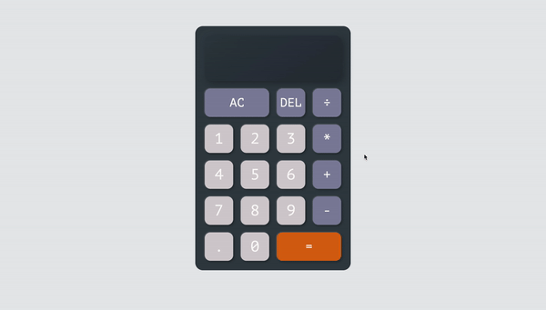

## CalculatorJS
### Project brief
Build a calculator using JavaScript
Features:
- do basic calculations: addition, subtraction, multiplication, division
- calculation can work with floating point numbers
- continuous calculation on placeholder panel when calculation is not finished yet

### Demo
[demo page here](https://khanhngguyen.github.io/calculatorJS/)

### Development phases
##### Phase 1: the basics
- create index.html file
- added styles in style.css
    - add colors to buttons
    - add shadows to create 3d effect
#### Phase 2: add interactions & fix issues
- add functions to number buttons & operation buttons
    - prevent "." button from being clicked multiple times
    - prevent operation button from being cliked when the result panel is empty
- add functions to AC (all-clear) & DEL (delete) buttons
- add function to update result display
    - update & display result on main panel when "=" is clicked
    - update & display result placeholder panel as well by adding previous calculation, e.g. "12 + "
- add computation function
    - add switch cases for each chose operations (+, -, *, ÷)
    - prevent "=" button from being clicked when calculation is not done yet
    - add computation for result placeholder panel when calculation is not done yet

### Learning outcomes
CSS
- grid display
- box-shadow

JavaScript
- class
- this

### Known limitations
Can't use "-" button to create negative number

### Goals for next project
Add keydown Event Listener for each button to
Work with negative number

#### References
Buil A Calculator With JavaScript Tutoril by Web Dev Simplified: [link](https://youtu.be/j59qQ7YWLxw)
MechaCalc - Calculator App by Afrills on Dribble: [link](https://dribbble.com/shots/15359416-MechaCalc-Calculator-App/attachments/7120585?mode=media)
